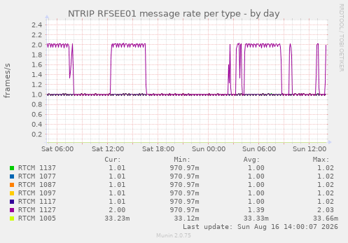

# ntrip-monitord — the NTRIP monitoring service

`ntrip-monitord` watches one or more NTRIP mountpoints continuously and
publishes per-mountpoint statistics snapshots that a Munin plugin turns
into graphs: throughput, frame integrity, message rates, satellites,
C/N0 and availability. It is the tool for the question the interactive
applications cannot answer: *was this stream healthy last night?*

Everything here was exercised on a production deployment (Ubuntu 24.04,
munin-node 2.0); the pitfalls documented below were hit for real.

## How it works

```
ntrip-monitord ── holds one persistent session per mountpoint
      │
      │  every interval_s, writes atomically (tmp + rename)
      ▼
/var/lib/ntrip-monitor/<mountpoint>.json         ← a snapshot: this instant
/var/lib/ntrip-monitor/<mountpoint>.report.json  ← a report: the last hour
      │
      │  read at munin-node's poll (every 5 min)
      ▼
munin plugin `ntrip_monitor` ── prints multigraph config/values
```

A daemon, not a self-contained plugin, for a reason: munin-node invokes
plugins for a few seconds every five minutes. Rates need a persistent
connection, and dropouts — the thing a stream monitor most needs to
catch — are invisible to a probe that connects briefly per poll.

The snapshot is single-line JSON in the project-wide statistics schema
(`src/core/ns_stats.h`, `schema_version` field). It is written to a
temporary file and `rename()`d into place, so a reader never sees a
half-written document. The same file is directly usable by anything
else: `cat`, `jq`, a cron job.

### The two documents answer different questions

The snapshot says what is true **now** — bytes a second, satellites this
moment, whether the socket is up. The report says whether the station has
**been** fit, over a window of hours, in the vocabulary of tier 2:
`STABLE`, `DEGRADED`, `UNSTABLE`, `INSUFFICIENT EVIDENCE`. A station can
be perfectly healthy this second and have been unstable all week; those
are not contradictions, and giving them one file and one vocabulary would
make them look like one.

The report's windows are measured in *stream* time, which is what lets a
replay reproduce a live run — and means that a stopped stream freezes the
window rather than shortening it. After `stale_s` (120 s by default) with
no movement of the stream clock, `overall_name` reverts to `INSUFFICIENT
EVIDENCE` and the headline says how long it has been, rather than
standing behind a window that ended. Watch for that as well as for
`DEGRADED`: a station whose report stops changing is a station that has
stopped.

```json
{"report_schema_version":1,"mountpoint":"HANESE","window_s":3600.000,
 "samples":3598,"overall":1,"overall_name":"STABLE",
 "headline":"STABLE over 1.0 h","integrity_verdict":1,...}
```

The version key is `report_schema_version`, not `schema_version`, and the
difference is deliberate: the Munin plugin finds snapshots by globbing
`*.json` and keeping whatever carries a `schema_version`. Under that name
a report would look like a snapshot to **any plugin older than it** — a
phantom graph family per station, full of undefined values, on every host
where the daemon is updated before the plugin.

Flat, single-line, one key per figure — the same shape the shell plugin
already reads, so nothing needs a JSON parser. Every metric contributes
`<name>_verdict` (0 insufficient, 1 stable, 2 degraded, 3 unstable),
`<name>_value` and `<name>_detail`. A metric that **cannot** be measured
emits `null` rather than a zero, so a graph cannot draw "not applicable"
as "fine".

**The window rolls, and it is measured in stream time.** The report
covers between one and two `report_window_s` — the daemon keeps two
staggered accumulators and always publishes the older, so the figure
never goes blank at a boundary. A session-scoped window would be
worthless here: this daemon runs for months, and "the worst CRC rate
since March" is not a thing anyone can act on. Stream time rather than
wall time means a station that goes silent stops advancing its own
window, instead of accumulating an hour of silence as an hour of health.

## Building

On the target machine (needs `build-essential`):

```sh
make -C service
```

The Makefile compiles the daemon against the same `src/core/`,
`src/net/` and `src/session/` sources as the CLI and GUI, so all
artefacts report the same version (`ntrip-monitord --version`).

## Installing

```sh
cd service
sudo make install
```

This installs, in order:

| What | Where |
|---|---|
| `ntrip-monitord` | `/usr/local/sbin/` |
| systemd unit | `/etc/systemd/system/ntrip-monitord.service` |
| Munin plugin | `/usr/local/share/munin/plugins/ntrip_monitor` |
| Example config | `/etc/ntrip-monitord/monitord.example.json` |
| sysusers fragment | `/usr/lib/sysusers.d/ntrip-monitord.conf` |
| State directory | `/var/lib/ntrip-monitor/` |

and runs `systemd-sysusers`, which creates the `ntrip-monitor` system
account the unit runs as.

**Why a static account and not `DynamicUser=`:** deployment proved
DynamicUser wrong for this service. systemd relocates a dynamic user's
state directory under `/var/lib/private/`, which is root-only — and the
entire point of the state directory is that the *munin* user reads it.
The unit therefore uses `User=ntrip-monitor` with
`StateDirectoryMode=0755` and `UMask=0022`, so snapshots come out
world-readable whatever the ambient umask.

## Configuring

```sh
sudo cp /etc/ntrip-monitord/monitord.example.json /etc/ntrip-monitord/monitord.json
sudo chown root:ntrip-monitor /etc/ntrip-monitord/monitord.json
sudo chmod 640 /etc/ntrip-monitord/monitord.json
sudo nano /etc/ntrip-monitord/monitord.json
```

The `chown`/`chmod` matter: the config holds caster passwords, so it
should be readable by the service group and nobody else.

```json
{
  "output_dir": "/var/lib/ntrip-monitor",
  "interval_s": 10,
  "mountpoints": [
    {
      "caster": "caster.example.net",
      "port": 2101,
      "mountpoint": "EXAMPLE1",
      "username": "user",
      "password": "password",
      "tls": false,
      "send_gga": false,
      "latitude": 52.0,
      "longitude": 6.0,
      "stall_timeout_s": 60
    }
  ]
}
```

- `output_dir` must match the Munin plugin's `env.statedir` (both
  default to `/var/lib/ntrip-monitor`).
- `thresholds` judges by a policy of your own rather than the built-in
  values — either a path to a JSON policy file, or the policy inline as
  an object. The daemon **refuses to start** if it cannot be applied,
  naming the field at fault: an operator who asked for a standard must
  get it or be told why, rather than have months of graphs published
  against something else. Every report then carries the policy name and
  a fingerprint over the effective values, and the startup line says the
  same. See [thresholds.md](thresholds.md).
- `report_window_s` is the tier-2 rolling window, 3600 by default; the
  published report covers between one and two of them. Values below 600
  are ignored, because 600 seconds is the least evidence the report will
  judge on at all and a shorter setting could only ever publish
  `INSUFFICIENT EVIDENCE`.
- `tls: true` speaks TLS to that caster. An explicit choice, never
  inferred from the port, and the certificate is always verified
  against the embedded Mozilla roots — a failed handshake or a wrong
  certificate is a classified failure, not a silent retry loop.
- `send_gga: true` enables a periodic GGA uplink at the configured
  position — required by VRS / network mountpoints, harmless elsewhere.
- `stall_timeout_s` is how long a connected but silent socket is
  tolerated before the stream counts as dead and the daemon reconnects;
  60 seconds by default, `0` waits forever. A caster can stop sending
  without closing anything, and nothing else in the daemon notices: the
  socket stays established and every published status keeps saying the
  stream is fine. Raise it for a mountpoint that broadcasts only
  occasionally; a 1 Hz observation stream that sends nothing for a
  minute has stopped.
- Up to 16 mountpoints; the daemon round-robins them on one thread.

This is deliberately **not** the interactive tools' `config.json`: that
schema describes one connection, a monitor needs a list.

## Running

```sh
sudo systemctl daemon-reload
sudo systemctl enable --now ntrip-monitord
journalctl -u ntrip-monitord -f      # logs go to stderr → journald
ls -la /var/lib/ntrip-monitor/       # one <mountpoint>.json per stream
```

The daemon reconnects with exponential backoff (5 s doubling to 60 s)
when a caster drops, and counts every reconnect in the snapshot.

For testing without systemd, `--oneshot` connects, waits a settling
window, publishes one snapshot per mountpoint and exits:

```sh
ntrip-monitord --config test.json --oneshot
```

## Wiring up Munin

```sh
sudo ln -s /usr/local/share/munin/plugins/ntrip_monitor /etc/munin/plugins/
sudo systemctl restart munin-node
```

Graphs appear under the **ntrip** category after two master poll cycles
(about ten minutes). Seven graph families per mountpoint:

| Graph | Shows | Alert defaults |
|---|---|---|
| throughput | bytes/s | — |
| integrity | CRC errors and framing re-syncs (rates) | warning on any CRC error |
| satellites | satellites tracked | — |
| cnr | mean C/N0 | warning below 35 dB-Hz |
| iono | median and worst-satellite ROTI | — |
| availability | connected (0/1), reconnects | critical when not connected |
| msgrate | frames/s per RTCM type | — |

### What they look like

A day of `RFSEE01`, a six-constellation MSM7 station on a domestic
connection. These are the graphs as Munin draws them — the point of the
daemon is that these exist at all for a stream, which no NTRIP tool
otherwise gives you.

<table>
<tr>
<td width="50%"></td>
<td width="50%"></td>
</tr>
<tr>
<td><em><strong>Throughput.</strong> Flat is healthy. The first thing to
move when a station degrades, and the easiest to attribute.</em></td>
<td><em><strong>Satellites tracked.</strong> Currently in view, not seen
this session — so the daily rise and fall is the constellation, while a
slow decline over weeks is the horizon changing.</em></td>
</tr>
<tr>
<td width="50%"></td>
<td width="50%"></td>
</tr>
<tr>
<td><em><strong>Mean C/N0.</strong> The antenna and LNA chain, which
ages. A step down overnight is rain in a connector far more often than
it is the receiver.</em></td>
<td><em><strong>Ionosphere (ROTI).</strong> Median and worst satellite.
The one cause of poor RTK that is nobody's fault and needs
proving.</em></td>
</tr>
<tr>
<td colspan="2"></td>
</tr>
<tr>
<td colspan="2"><em><strong>Message rate per type.</strong> A station
that silently stops sending 1005, or halves its MSM rate, shows up here
and nowhere else.</em></td>
</tr>
</table>

An eighth family, **stability**, draws the six tier-2 verdicts —
availability, frame integrity, signal level, satellites held, ionosphere
and delivery rate — on one 0–3 scale: 0 insufficient evidence, 1 stable,
2 degraded, 3 unstable. It is the only graph here that describes a
*window of hours* rather than an instant, and it reads differently for
it: a flat line at 1 is a station that has been fit for as long as the
window is long, and a step to 2 says which of the six moved.

Degraded warns and unstable is critical, so Munin will alert on them.
**Insufficient evidence never alerts** — it is the honest state for the
first ten minutes after a restart, and a monitor that pages every time
the daemon is upgraded is a monitor people turn off. A metric that
cannot be measured on a given stream reads `U` rather than 0, so "not
applicable" is never drawn as "fine".

The family appears only when the daemon is new enough to publish
reports, so upgrading the plugin ahead of the daemon changes nothing and
breaks nothing.

The remaining two families — integrity and availability — are flat lines
on a healthy station and are worth looking at only when something is
wrong, which is exactly when their alert defaults fire.

Plugin configuration, if the defaults need changing
(`/etc/munin/plugin-conf.d/ntrip`):

```
[ntrip_monitor]
env.statedir /var/lib/ntrip-monitor
env.stale    120
```

### Staleness is a feature

A snapshot older than `env.stale` seconds (default 120) is reported as
`U` — undefined — for every field. Reporting the last known values
instead would draw a flat, healthy-looking line while the daemon is
down, which is precisely the wrong failure mode for a monitor. If all
your ntrip graphs go blank at once, check the daemon first:
`systemctl status ntrip-monitord`.

Two further behaviours worth knowing:

- The plugin ignores JSON files without a `schema_version` field, so a
  stray file in the state directory cannot invent a graph family.
- Munin field names are a frozen contract. Munin has no version
  negotiation; renaming a field silently starts a new RRD and orphans
  the history.

### Satellites and C/N0

`sats_total` and `cnr_mean` report the satellites observed within the
last five seconds and their mean C/N0, tracked in the session layer so
the daemon, the GUI and Android all count the same way.

Two things worth knowing when reading those graphs:

- **The count is "currently in view", not "seen this session".** A
  satellite that sets drops out of the count. That is what makes the
  graph useful as a health signal: a base losing sky view shows a
  falling line rather than a permanently rising one.
- **C/N0 needs MSM7.** MSM4/5/6 carry no extended C/N0 field, so a base
  transmitting only those reports satellite counts with `cnr_mean` at
  zero. That is the stream's doing, not the daemon's. If you need the
  signal graph, configure the base to send MSM7 (1077/1087/1097/1127).

## Verifying the chain

Each stage can be checked independently, from producer to consumer:

```sh
systemctl is-active ntrip-monitord                    # daemon up?
ls -l --time-style=full-iso /var/lib/ntrip-monitor/   # snapshot fresh?
cat /var/lib/ntrip-monitor/<MP>.json | jq .connected  # content sane?
sudo munin-run ntrip_monitor                          # plugin output?
rrdtool lastupdate /var/lib/munin/*/[host]-ntrip_throughput_*-g.rrd
```

A graph that "does not update" usually turns out to be a zoom window
far wider than the data: RRDs created twenty minutes ago render as a
sliver at the right edge of a 30-hour view.

## Troubleshooting

| Symptom | Likely cause |
|---|---|
| Snapshots exist but Munin shows nothing | Plugin not symlinked, or `env.statedir` mismatch |
| All graphs blank (`U`) | Daemon stopped — the staleness guard is doing its job |
| `connected` is 0, `reconnects` climbing | Caster unreachable or credentials rejected; see `journalctl -u ntrip-monitord` |
| Snapshots under `/var/lib/private/` | The unit was started with an old `DynamicUser=` version; reinstall the unit, `systemctl daemon-reload`, remove the stale directories, restart |
| Plugin works via `munin-run` but not in graphs | munin *master* not polling this node; check `/var/log/munin/munin-update.log` |

## See also

- [Documentation index](index.md)
- [`design/architecture.md`](https://github.com/pe1mew/NTRIP-Analyser/blob/main/design/architecture.md) §5 — why the
  daemon+plugin shape was chosen
- `src/core/ns_stats.h` — the snapshot schema the JSON follows
