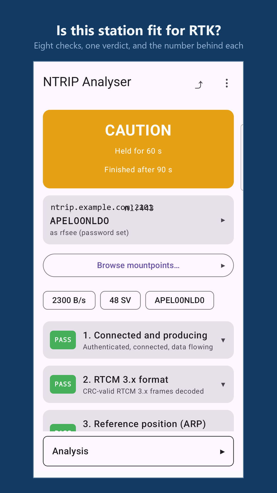
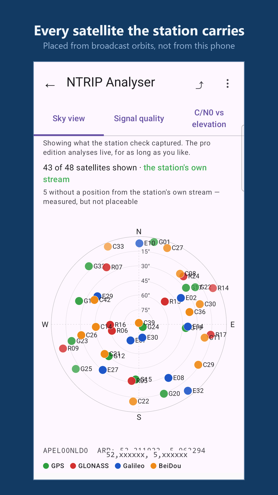
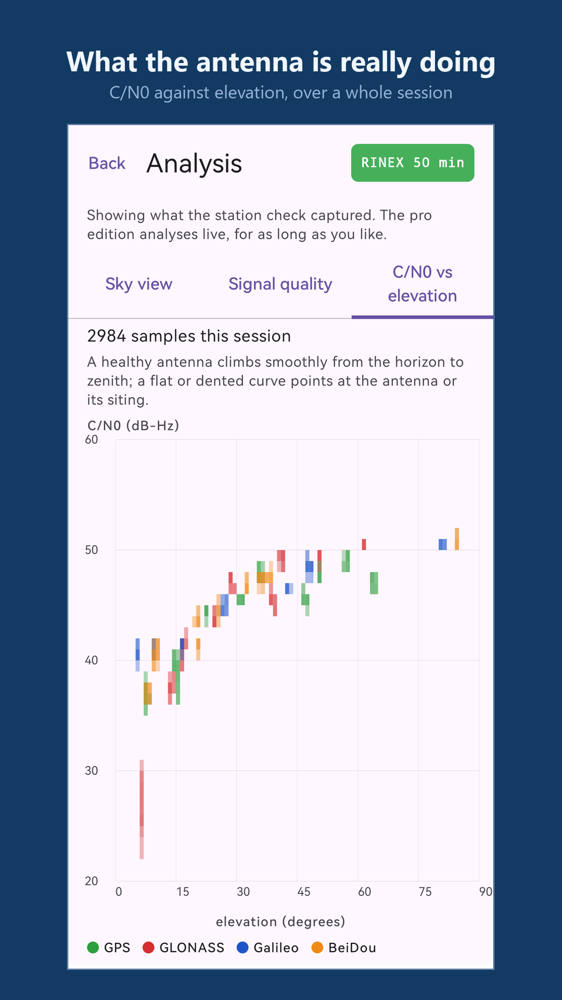
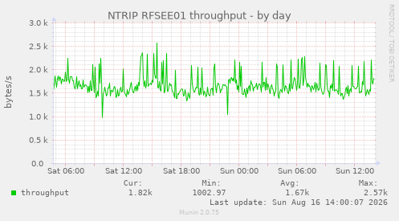
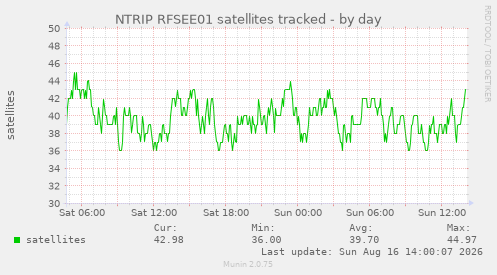
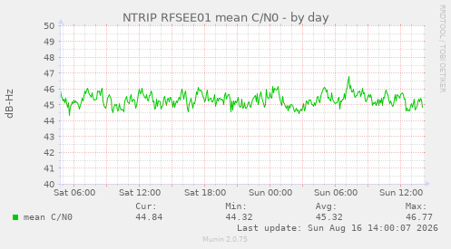
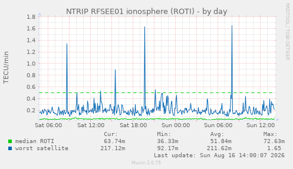

# NTRIP-Analyser

[](https://github.com/pe1mew/NTRIP-Analyser/actions/workflows/ci.yml)

A tool for analysing NTRIP RTCM 3.x data streams, available as both a command-line interface (CLI) and a Windows graphical user interface (GUI).

---

## On Android: NTRIP Analyser

**Point your phone at a base station and find out whether it is fit to
serve RTK.** Eight checks, each with its verdict and the number behind
it, then the analysis views: the sky the station is tracking, C/N0 per
satellite, and C/N0 against elevation — the picture that shows an
antenna or siting problem for what it is.

| | |
|---|---|
| **NTRIP Analyser** | free. The full eight-check verdict, the analysis views, and the sourcetable browser, for one caster at a time. |
| **NTRIP Analyser Pro** | *under development.* Adds watch mode for hours-long measurement, live position for network mountpoints, saved connections, and an ephemeris side-stream for a complete sky. |

<table>
<tr>
<td width="33%"></td>
<td width="33%"></td>
<td width="33%"></td>
</tr>
</table>

### It is on Google Play

**→ [Get NTRIP Analyser on Google Play](https://play.google.com/store/apps/details?id=nl.pe1mew.ntripanalyser.free)**

Free, no advertising, no account, and nothing leaves the phone but the
NTRIP connection you configure — see the
[privacy policy](https://pe1mew.github.io/NTRIP-Analyser/privacy-policy.html).

**Testers are wanted.** Google requires **twelve testers who stay
opted in for fourteen days** before a new developer account may go to
production, so joining the test is a genuine help rather than a
formality. Submit an issue with your request and we will add you to the test-group.

**→ [Join the test](https://play.google.com/apps/testing/nl.pe1mew.ntripanalyser.free)**

What would help most is telling us about a station where the verdict
looks wrong — [open an issue](https://github.com/pe1mew/NTRIP-Analyser/issues)
with the caster, the mountpoint and what you expected. A verdict that
disagrees with a station you know is the most useful bug report this
project can receive, because every threshold behind it is a judgement
rather than a fact ([which ones, and how well founded](https://pe1mew.github.io/NTRIP-Analyser/thresholds.html)).

### Samsung Galaxy Store, and F-Droid from our own repository

The free edition is planned for both, and neither is live yet.

**F-Droid's official repository cannot take it**, and that is a licence
matter rather than a technical one: F-Droid requires Free, Libre and
Open Source Software, and this project's Commons Clause withholds the
right to sell. So the free edition will be published from **an F-Droid
repository we host ourselves** — the same client and the same update
mechanism, added by URL. The link will appear here when it exists.

**Samsung Galaxy Store** has no such requirement; the free edition is
planned there once its rules have been read properly.

The plan is in
[`design/work-items/release-to-play.md`](design/work-items/release-to-play.md).

**Desktop users**: the Windows GUI, the CLI and the Linux monitoring
daemon are below, and are not affected by any of this.

---

## About this project

The primary goal of this project is to deepen my understanding of NTRIP streams, a field where open-source tools and public information are limited. By building this analyser, I aim to explore and learn the structure and content of RTCM 3.x messages transmitted over NTRIP.

A secondary goal is to practice and experiment with programming, leveraging AI tools such as GitHub Copilot and Claude Code. Please note that, while AI assistance has accelerated development, I cannot guarantee the originality or accuracy of all code segments, as the sources used by large language models are not always transparent or verifiable. The results and information presented here have not been exhaustively validated. As such, I advise caution: **do not rely on this code or its output for critical applications without independent verification.** The included disclaimer applies in full.

## Three programs on the desktop and the server

NTRIP-Analyser ships as **three separate programs** built from the same
core library, so all three decode RTCM identically and judge a station by
the same eight checks. They differ in how you drive them and in what they
can show. (The [Android app](#on-android-ntrip-analyser) above is the
fourth, built from the same core again.)

| | **GUI** | **CLI** | **Service** |
|---|---|---|---|
| Executable | `bin/ntrip-analyser-gui.exe` | `bin/ntrip-analyser.exe` (Windows)<br>`bin/ntrip-analyser` (Linux) | `ntrip-monitord` |
| Platform | Windows only (native Win32) | Windows and Linux | Linux / UNIX |
| Driven by | Point and click | Command-line arguments | A config file and systemd |
| Configuration | On-screen fields, saved to JSON | A JSON file — start from [`bin/exampleConfig.json`](bin/exampleConfig.json) | `/etc/ntrip-monitord/monitord.json` |
| Best for | Investigating a stream interactively | Automation, scripting, cron, captures | Watching stations for months |
| Mountpoints at once | One | One | All of them |
| Live visualisation | Sky plot, signal quality, session history, VRS monitor | Sky-coverage heatmap (PNG, via `--sky`) | Munin graphs |
| Stream health checks | Yes — handshake, CRC, advertised-vs-observed, position | Yes — via `--check` and `-t` | Published continuously |
| Station acceptance test | Yes — View > Station Check | Yes — `--check` / `--check-vrs`, with exit codes for scripting | No — it reports measurements and leaves the verdict to you |
| Capture to file | Yes — File > Start RTCM Capture | Yes — `--capture` | Not exposed |
| Output | On-screen, plus PNG snapshots | Console text, PNG, `.rtcm3` captures, `--json` | One JSON snapshot per mountpoint, per interval |

> **Trying it out:** a ready-to-edit configuration ships as
> [`bin/exampleConfig.json`](bin/exampleConfig.json) (and as an asset on
> each [release](https://github.com/pe1mew/NTRIP-Analyser/releases)).
> It targets the Dutch Kadaster open caster, ephemeris stream included,
> so the sky plot works out of the box. **No account is needed** — the
> AGRS.NL streams it uses are served anonymously, which is why the
> username and password in it are empty. Verified: that file returns
> STATION OK on all eight KPIs with no credentials at all.
>
> Registration and payment apply to Kadaster's *NETPOS* network-RTK
> service, which is a different thing — see
> [NSGI](https://www.nsgi.nl/referentiepunten-en-gnss-data/gnss-data/real-time-streams).
> For any other caster, holding valid access is yours to arrange: the
> analyser connects where you point it and supplies no credentials of
> its own.

**Which should I use?**

- **Diagnosing a mountpoint** — use the GUI. The Stream Health tab answers
  "is this stream healthy" directly, and the chart windows show things a
  console cannot.
- **Unattended or repeated runs** — use the CLI. It takes `--duration`,
  emits machine-readable status with `--json`, captures the stream to a
  file and can replay one, so it fits cron jobs and scripts.
- **Watching a station for months** — run the service. A spot check tells
  you a station is fit today; only a permanent observer tells you it has
  *stayed* fit, and dropouts are invisible to anything that connects
  briefly per poll.
- **Not on Windows** — the CLI and the service; the GUI is Win32-native.

All three are documented in full: **[GUI User Guide](docs/gui.md)**,
**[CLI Manual](docs/cli.md)** and
**[Service Manual](docs/service.md)**.

### Command-Line Interface (CLI)

Full analysis via command-line arguments, suited to automation, scripting
and remote operation.

```sh
ntrip-analyser -g                          # write a template config.json
ntrip-analyser -m                          # list the caster's mountpoints
ntrip-analyser -d                          # decode the stream
ntrip-analyser -d 1005,1077                # decode only these message types
ntrip-analyser -t 60                       # message-type statistics for 60 s
ntrip-analyser -s 60                       # unique satellites for 60 s
ntrip-analyser --sky -R nav.rnx --duration 900   # 15-min coverage heatmap PNG
```

Reads `config.json` from the working directory. `--sky` needs ephemerides,
and takes them from the station itself where it broadcasts them; for a
station that does not, supply an `EPH_CASTER` block in the config or a
RINEX 3 NAV file via `-R`. It can also replay a capture offline:

```sh
ntrip-analyser --sky --rtcm-stdin -R nav.rnx < capture.rtcm3
```

The station acceptance test is the CLI at its most useful — eight checks,
about ninety seconds, and an exit code a script can act on:

```
#   KPI                        verd         value  detail
1   Connected and producing    PASS       1722.84  Authenticated, connected, data flowing
2   RTCM 3.x format            PASS        537.00  CRC-valid RTCM 3.x frames decoded
3   Reference position (ARP)   PASS          1.00  1005/1006 received with non-zero coordinates
4   Observations flowing       PASS          6.00  Every constellation streaming at 0.5 Hz or faster
5   Satellites in view         PASS         39.00  At or above what this station advertises
6   Median C/N0                PASS         45.28  Antenna and LNA chain healthy
7   Frame integrity (CRC)      PASS          0.00  Fewer than 1 error per 1000 frames
8   Advertised versus actual   WARN          1.00  Streaming a constellation the sourcetable omits

== CAUTION ==  exit=6
```

That run is a real one, and KPI 8 caught a real fault: the station was
streaming NavIC while its sourcetable entry did not declare it — a
registration error nobody had noticed.

`--sky` writes the coverage heatmap as a PNG — the same view shown under
[Screenshots](#screenshots) above, produced without a window, so a cron
job can leave a nightly plot on disk.

See the [CLI manual](docs/cli.md) for the full option list.

### Windows GUI Application

A desktop interface with real-time monitoring, stream health analysis,
message statistics, satellite tracking and detailed message decoding.

Built with the native Win32 API in C99, with no dependencies beyond the
Windows SDK and GDI+. See the [GUI documentation](docs/gui.md).


*The main window. The Stream Health tab is flagging a real problem: this
mountpoint advertises seven message types but one of them never arrives,
and the station has not broadcast its position at all.*

<table>
<tr>
<td width="50%"></td>
<td width="50%"></td>
</tr>
<tr>
<td valign="top"><b>Sky Plot</b> — every tracked satellite at its azimuth and
elevation as seen from the reference station, coloured by constellation and
trailed over the session.</td>
<td valign="top"><b>Signal Quality</b> — C/N0 per satellite, and C/N0 against
elevation over the whole session. A healthy antenna rises steadily from
horizon to zenith; obstructions show as a dip.</td>
</tr>
<tr>
<td width="50%"></td>
<td width="50%"></td>
</tr>
<tr>
<td valign="top"><b>Session History</b> — throughput, message rate, CRC errors,
satellites, C/N0 and reference drift on one shared time axis, so a dropout is
visible instead of averaged away.</td>
<td valign="top"><b>Coverage heatmap</b> — observed versus expected satellite
coverage per sky sector, which reveals where the station's view is blocked.</td>
</tr>
</table>

### Monitoring service (`ntrip-monitord`)

The unattended member of the suite: it holds one session per configured
mountpoint, indefinitely, and writes each one's statistics as a JSON
snapshot for Munin — or for anything else that reads JSON.

It exists because a probe that connects briefly per poll cannot see the
thing a stream monitor most needs to catch. Rates need a persistent
session, and a dropout between two polls leaves no trace at all.

```sh
sudo systemctl enable --now ntrip-monitord
sudo ln -s /usr/local/share/munin/plugins/ntrip_monitor /etc/munin/plugins/
```

Seven graph families per mountpoint. A day of a six-constellation MSM7
station:

<table>
<tr>
<td width="50%"></td>
<td width="50%"></td>
</tr>
<tr>
<td width="50%"></td>
<td width="50%"></td>
</tr>
</table>

Throughput, satellites tracked, mean C/N0 and the ionosphere — plus frame
integrity, availability and the per-type message rate, which are flat
lines until something goes wrong. Ships as a tarball with a hardened
systemd unit, a `sysusers` fragment and the Munin plugin. See the
[Service Manual](docs/service.md).

## What it measures

The table above says which program shows what. This is what the shared
core measures underneath all of them — one implementation, so a station
cannot pass in one program and fail in another.
[`design/feature-matrix.md`](design/feature-matrix.md) has the full
per-product breakdown.

**The station acceptance test** — eight KPIs, about ninety seconds, and a
verdict that must hold for sixty continuous seconds before it is
reported, so a station that flickers cannot pass by being healthy at the
right moment. Network mountpoints add the VRS assertions, because a
moving reference point is correct behaviour there and a fault everywhere
else.

**Any RTCM 3 observation format**, not only the modern ones. Satellites
are counted from MSM1 through MSM7 and from the legacy 1001–1004 and
1009–1012, so a station built before MSM is graded rather than failed for
its age. Signal strength is read wherever the format carries it — a whole
dB-Hz in MSM4 and MSM5, a sixteenth in MSM6 and MSM7, a quarter in the
legacy messages — and MSM1–3 carry none at all, which the verdict says in
those words instead of blaming the station.

**Whether the stream is what it claims to be.** The caster handshake
(NTRIP 1.0 ICY against 2.0 HTTP, status and caster software); frame
integrity as a rate, not a count — CRC-24Q failures, malformed frames,
framing re-syncs; every message type the sourcetable promises compared
against what arrives and how often; and the sourcetable's position
cross-checked against the broadcast 1005/1006, which catches a
registration that has drifted from the antenna.

**Where the signal comes from, and where it doesn't.** Satellites placed
at their true azimuth and elevation from the station's own reference
point, observed-against-expected coverage per sky sector, and C/N0
against elevation over a session — a clean installation rises
monotonically from horizon to zenith, and an obstruction shows as a dip
at particular elevations. Orbits come from the station's own stream where
it broadcasts them, from a second NTRIP connection carrying 1019 / 1020 /
1042 / 1044 / 1045 / 1046, or from a RINEX 3 navigation file you supply.

**The ionosphere**, as ROTI per satellite from dual-frequency MSM6/7 —
the one cause of poor RTK that is nobody's fault and needs proving.

**And the stream itself, kept.** Capture writes CRC-valid frames to a
`.rtcm3` file, and replay feeds one back through the identical code path,
so an analysis is reproducible and a bug report can travel with its
evidence.

## Documentation

- **[Documentation Index](docs/index.md)** — Which application, which page ([published site](https://pe1mew.github.io/NTRIP-Analyser/))
- **[Compilation Guide](docs/compile.md)** — Build instructions for Windows and Linux
- **[GUI User Guide](docs/gui.md)** — Complete Windows GUI documentation
- **[CLI Manual](docs/cli.md)** — Command-line usage and configuration
- **[JSON Configurations](docs/jsonConfigs.md)** — The single- and multi-connection config formats, and handling their plain-text passwords
- **[Service Manual](docs/service.md)** — ntrip-monitord and the Munin graphs
- **[Feature Backlog](design/todo.md)** — What is shipped, what is planned, and why
- **[Architecture](design/architecture.md)** — Structure for sharing one core across the CLI, GUI, monitoring service and Android app
- **[GUI Design Document](design/gui-design.md)** — Windows GUI design decisions
- **[Agent notes](CLAUDE.md)** — Constraints and navigation for AI-assisted work, with [docs/RUNBOOK.md](docs/RUNBOOK.md) and [memory/](memory/MEMORY.md)

## Quick Start

### Building

One build system for every desktop program — the CLI everywhere, the
GUI on Windows, the daemon on UNIX:

```bash
cmake -S . -B build
cmake --build build
```

Binaries land in `bin/`. (The hand-listed gcc one-liners that stood
here fell behind the source tree twice and retired with the TLS
rollout; `CMakeLists.txt` is the only source list.)

See [compilation guide](docs/compile.md) for complete build instructions.

# License

**Two licences, and which one applies depends on what you are using.**

| What | Licence |
|---|---|
| The code | [Apache License 2.0 with the Commons Clause](LICENSE) |
| The documentation and other non-code content | [CC BY-NC 4.0](license.md) |

The Commons Clause forbids **selling** the software — including paid
hosting or support where the value comes substantially from it. It does
not stop anyone using it internally on their own base stations, which is
ordinary commercial use. [`docs/licences.md`](docs/licences.md) sets out
the full position, what the project depends on, and what it connects to.

Documentation is Creative Commons Attribution-NonCommercial 4.0
International (http://creativecommons.org/licenses/by-nc/4.0/) by Remko Welling — E-mail: pe1mew_at_gmail.com

<a rel="license" href="http://creativecommons.org/licenses/by-nc/4.0/"></a><br />This work is licensed under a <a rel="license" href="http://creativecommons.org/licenses/by-nc/4.0/">Creative Commons Attribution-NonCommercial 4.0 International License</a>.

# Disclaimer
This project is distributed in the hope that it will be useful, but WITHOUT ANY WARRANTY; without even the implied warranty of MERCHANTABILITY or FITNESS FOR A PARTICULAR PURPOSE.