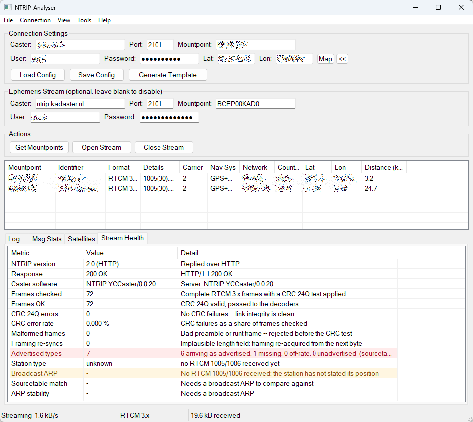
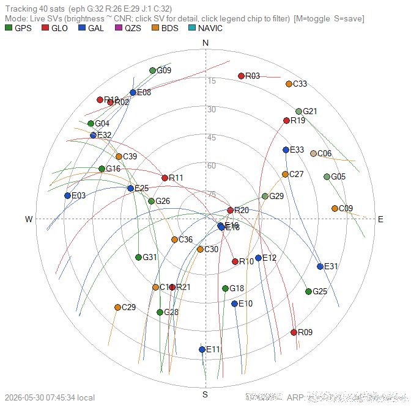
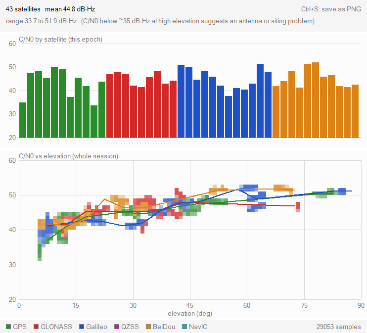
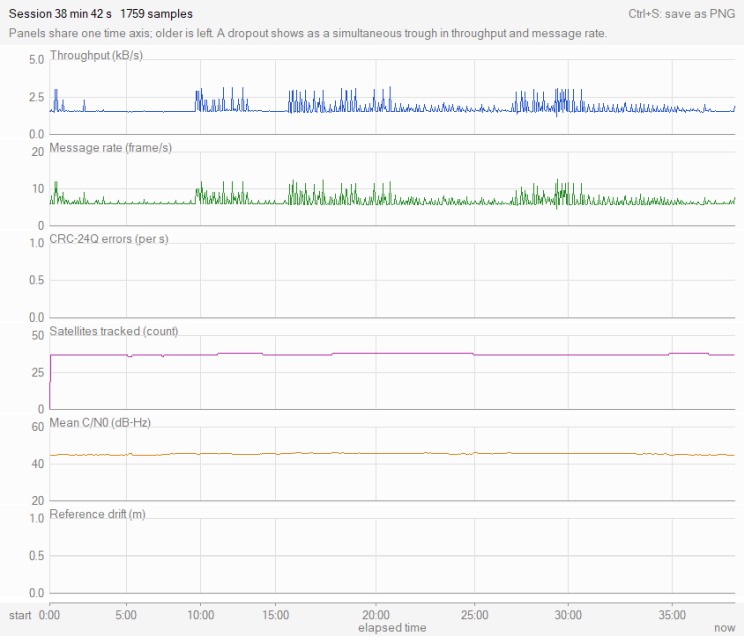
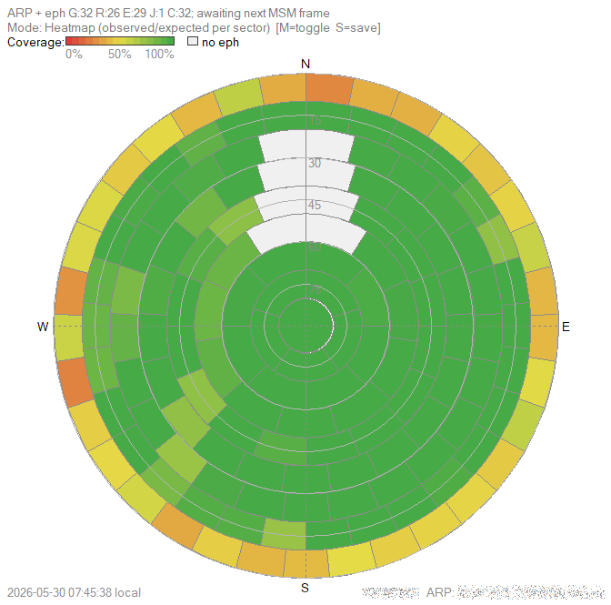

# NTRIP-Analyser

A tool for analysing NTRIP RTCM 3.x data streams, available as both a command-line interface (CLI) and a Windows graphical user interface (GUI).

## Screenshots



*The main window. The Stream Health tab is flagging a real problem: this
mountpoint advertises seven message types but one of them never arrives,
and the station has not broadcast its position at all.*

<table>
<tr>
<td width="50%"></td>
<td width="50%"></td>
</tr>
<tr>
<td valign="top"><b>Sky Plot</b> — every tracked satellite at its azimuth and
elevation as seen from the reference station, coloured by constellation and
trailed over the session.</td>
<td valign="top"><b>Signal Quality</b> — C/N0 per satellite, and C/N0 against
elevation over the whole session. A healthy antenna rises steadily from
horizon to zenith; obstructions show as a dip.</td>
</tr>
<tr>
<td width="50%"></td>
<td width="50%"></td>
</tr>
<tr>
<td valign="top"><b>Session History</b> — throughput, message rate, CRC errors,
satellites, C/N0 and reference drift on one shared time axis, so a dropout is
visible instead of averaged away.</td>
<td valign="top"><b>Coverage heatmap</b> — observed versus expected satellite
coverage per sky sector, which reveals where the station's view is blocked.</td>
</tr>
</table>

## About this project

The primary goal of this project is to deepen my understanding of NTRIP streams, a field where open-source tools and public information are limited. By building this analyser, I aim to explore and learn the structure and content of RTCM 3.x messages transmitted over NTRIP.

A secondary goal is to practice and experiment with programming, leveraging AI tools such as GitHub Copilot. Please note that, while AI assistance has accelerated development, I cannot guarantee the originality or accuracy of all code segments, as the sources used by large language models are not always transparent or verifiable. The results and information presented here have not been exhaustively validated. As such, I advise caution: **do not rely on this code or its output for critical applications without independent verification.** The included disclaimer applies in full.

## Two versions of the tool

NTRIP-Analyser ships as **two separate programs** built from the same core
library, so both decode RTCM identically. They differ in how you drive them
and in what they can show.

| | **GUI** | **CLI** |
|---|---|---|
| Executable | `bin/ntrip-analyser-gui.exe` | `bin/ntrip-analyser.exe` (Windows)<br>`bin/ntrip-analyser` (Linux) |
| Platform | Windows only (native Win32) | Windows and Linux |
| Driven by | Point and click | Command-line arguments |
| Configuration | On-screen fields, saved to JSON | `config.json` — start from [`bin/exampleConfig.json`](bin/exampleConfig.json) |
| Best for | Investigating a stream interactively | Automation, scripting, cron, headless servers |
| Live visualisation | Sky plot, signal quality, session history, VRS monitor | Sky-coverage heatmap (PNG, via `--sky`) |
| Stream health checks | Yes — handshake, CRC, advertised-vs-observed, position | No |
| Station acceptance test | Yes — View > Station Check | Yes — `--check` / `--check-vrs`, with exit codes for scripting |
| Output | On-screen, plus PNG snapshots | Console text, plus PNG for `--sky` |

> **Trying it out:** a ready-to-edit configuration ships as
> [`bin/exampleConfig.json`](bin/exampleConfig.json) (and as an asset on
> each [release](https://github.com/pe1mew/NTRIP-Analyser/releases)).
> It targets the Dutch Kadaster open caster, ephemeris stream included,
> so the sky plot works out of the box — substitute your own free
> Kadaster registration for the placeholder username and password.

**Which should I use?**

- **Diagnosing a mountpoint** — use the GUI. The Stream Health tab answers
  "is this stream healthy" directly, and the chart windows show things a
  console cannot.
- **Unattended or repeated runs** — use the CLI. It takes `--duration`,
  emits machine-readable status with `--json`, and can replay a capture
  from stdin, so it fits cron jobs and scripts.
- **Not on Windows** — the CLI is your only option; the GUI is Win32-native.

Both are documented in full: **[GUI User Guide](docs/gui.md)** and
**[CLI Manual](docs/cli.md)**.

### Command-Line Interface (CLI)

Full analysis via command-line arguments, suited to automation, scripting
and remote operation.

```sh
ntrip-analyser -g                          # write a template config.json
ntrip-analyser -m                          # list the caster's mountpoints
ntrip-analyser -d                          # decode the stream
ntrip-analyser -d 1005,1077                # decode only these message types
ntrip-analyser -t 60                       # message-type statistics for 60 s
ntrip-analyser -s 60                       # unique satellites for 60 s
ntrip-analyser --sky -R nav.rnx --duration 900   # 15-min coverage heatmap PNG
```

Reads `config.json` from the working directory. `--sky` needs ephemerides,
so it requires either an `EPH_CASTER` block in the config or a RINEX 3 NAV
file via `-R`. It can also replay a capture offline:

```sh
ntrip-analyser --sky --rtcm-stdin -R nav.rnx < capture.rtcm3
```

See the [CLI manual](docs/cli.md) for the full option list.

### Windows GUI Application

A desktop interface with real-time monitoring, stream health analysis,
message statistics, satellite tracking and detailed message decoding.

Built with the native Win32 API in C99, with no dependencies beyond the
Windows SDK and GDI+. See the [GUI documentation](docs/gui.md).

## Core Functionalities

The analyser can perform the following operations on NTRIP streams:

1. **Retrieve mountpoint list** from a caster and display available streams
2. **Connect to NTRIP stream** and receive RTCM data with:
   - Real-time message decoding for all implemented RTCM message types
   - Message statistics (count, minimum/average/maximum transmission intervals)
   - Filtered message decoding (show only specific message types)
   - Satellite analysis (count unique satellites per GNSS constellation)
3. **Station acceptance test** — eight KPIs over about ninety seconds,
   ending in a verdict that must hold for sixty continuous seconds before
   it is reported, so a station that flickers cannot pass by being healthy
   at the right moment. Available as `--check` in the CLI (exit 0 / 6 / 1,
   for installer sign-off or cron), as **View > Station Check** in the
   GUI, and as station mode in the Android app — one engine
   (`src/core/kpi.c`), so a station cannot pass in one and fail in
   another. Network mountpoints add the VRS assertions (`--check-vrs`).
4. **Stream health checks** (GUI) — answers "is this mountpoint actually
   healthy", not just "is data arriving":
   - **Caster handshake** — NTRIP 1.0 (ICY) vs 2.0 (HTTP), response status
     and caster software, with the full response headers in the log
   - **Frame integrity** — CRC-24Q error count and rate, malformed frames,
     framing re-syncs
   - **Advertised vs. observed** — every message type the sourcetable
     promises, compared against what actually arrives and at what rate;
     missing, off-rate and unadvertised types are called out
   - **Reference-station position** — the sourcetable position cross-checked
     against the broadcast RTCM 1005/1006 ARP, plus detection of a fixed
     base that moves mid-session
   - **VRS awareness** — network mountpoints are classified as such, so the
     fixed-base checks are not applied where a moving reference point is
     correct behaviour
5. **Live polar sky plot** (GUI) — floating window showing every tracked
   satellite at its azimuth / elevation as seen from the reference-station
   ARP, with two render modes:
   - **Markers** — per-GNSS coloured dots shaded by CNR, with a trail of
     past positions and a left-click SV detail popup
     (per-band CNR table, PRN, az/el)
   - **Heatmap** — Onocoy-style observed-vs-expected sector coverage map
     (150 sectors, red → yellow → green ramp)
6. **Signal quality** (GUI) — C/N0 bars per satellite for the current epoch,
   plus a C/N0-versus-elevation scatter over the whole session with a
   per-constellation mean. A clean antenna installation rises monotonically
   from horizon to zenith; obstructions and multipath show as a dip at
   particular elevations
7. **Session history** (GUI) — throughput, message rate, CRC errors,
   satellites tracked, mean C/N0 and reference-point drift plotted over time
   on a shared axis, so dropouts, bursts and reconnects are visible rather
   than averaged away
8. **VRS monitor** (GUI) — rover-to-virtual-station distance, a polar
   direction plot and a rolling distance chart, for analysing network
   services and their hand-overs
9. **Multi-GNSS ephemeris** (GPS / GLONASS / Galileo / QZSS / BeiDou) sourced
   from one of:
   - A second NTRIP connection that feeds RTCM 1019 / 1020 / 1042 / 1044 /
     1045 / 1046 frames into the eph cache (e.g. BKG `BCEP00BKG0` or
     Kadaster `BCEP00KAD0`), or
   - A RINEX 3 multi-GNSS NAV file loaded from disk
10. **RTCM capture and replay** (GUI) — save the live stream to a `.rtcm3`
   file and feed it back through the same UI pipeline for offline analysis
11. **PNG snapshots** of the sky plot, signal-quality and session-history
    windows, each self-contained with its own header/footer context

## Documentation

- **[Documentation Index](docs/readme.md)** — Which application, which page
- **[Compilation Guide](docs/compile.md)** — Build instructions for Windows and Linux
- **[GUI User Guide](docs/gui.md)** — Complete Windows GUI documentation
- **[CLI Manual](docs/cli.md)** — Command-line usage and configuration
- **[JSON Configurations](docs/jsonConfigs.md)** — The single- and multi-connection config formats, and handling their plain-text passwords
- **[Service Manual](docs/service.md)** — ntrip-monitord and the Munin graphs
- **[Feature Backlog](design/todo.md)** — What is shipped, what is planned, and why
- **[Architecture](design/architecture.md)** — Structure for sharing one core across the CLI, GUI, monitoring service and Android app
- **[GUI Design Document](design/gui-design.md)** — Windows GUI design decisions

## Quick Start

### Building

**Windows CLI:**
```batch
gcc -g -o bin/ntrip-analyser.exe src/cli/main.c lib/cJSON/cJSON.c src/core/rtcm3x_parser.c src/core/ns_stats.c src/net/ntrip_proto.c src/session/ntrip_session.c src/cli/cli_stream.c src/net/ntrip_handler.c src/core/config.c src/cli/cli_help.c src/core/nmea_parser.c src/core/sv_ephemeris.c src/core/sv_orbit.c src/core/sky_collect.c src/core/sky_render.c src/core/rinex_nav.c -Isrc -Ilib/cJSON -lws2_32 -lm -Wall
```

**Windows GUI:**
```batch
build-gui.bat
```

**Linux CLI:**
```bash
mkdir -p bin
gcc -g -o bin/ntrip-analyser src/cli/*.c src/core/*.c src/net/*.c src/session/*.c lib/cJSON/cJSON.c -Isrc -Ilib/cJSON -Wall -lm -lpthread
```

See [compilation guide](docs/compile.md) for complete build instructions.

## License and disclaimer. 

Please note the license at the end of this document. 

# License
This project is free: You can redistribute it and/or modify it under the terms of a Creative Commons Attribution-NonCommercial 4.0 International License (http://creativecommons.org/licenses/by-nc/4.0/) by Remko Welling (https://ese.han.nl/~rwelling) E-mail: remko.welling@han.nl

<a rel="license" href="http://creativecommons.org/licenses/by-nc/4.0/"></a><br />This work is licensed under a <a rel="license" href="http://creativecommons.org/licenses/by-nc/4.0/">Creative Commons Attribution-NonCommercial 4.0 International License</a>.

# Disclaimer
This project is distributed in the hope that it will be useful, but WITHOUT ANY WARRANTY; without even the implied warranty of MERCHANTABILITY or FITNESS FOR A PARTICULAR PURPOSE.